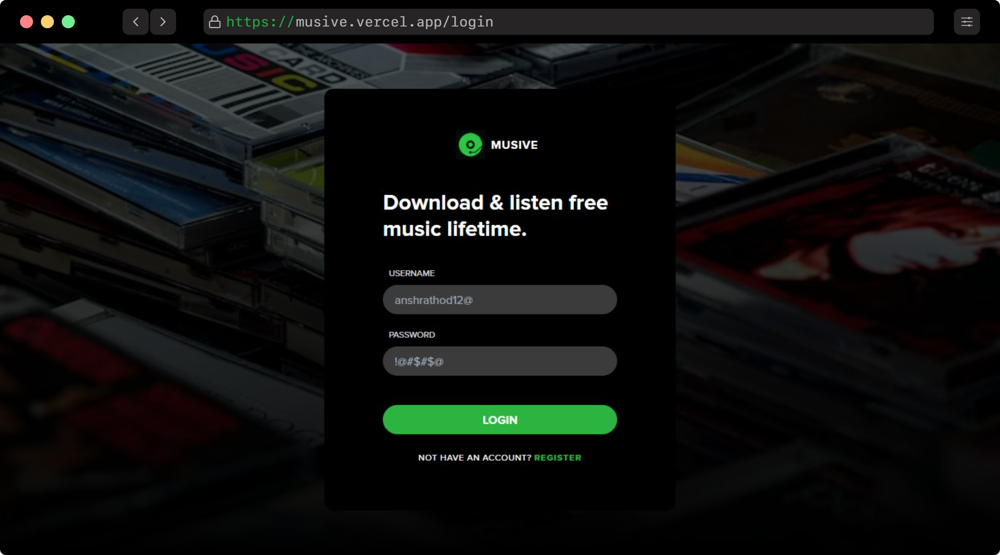
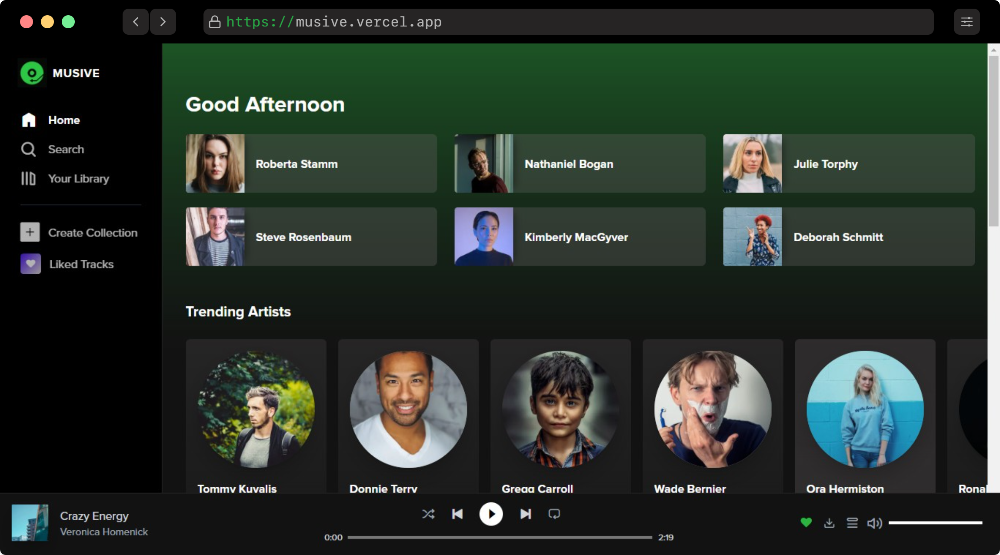
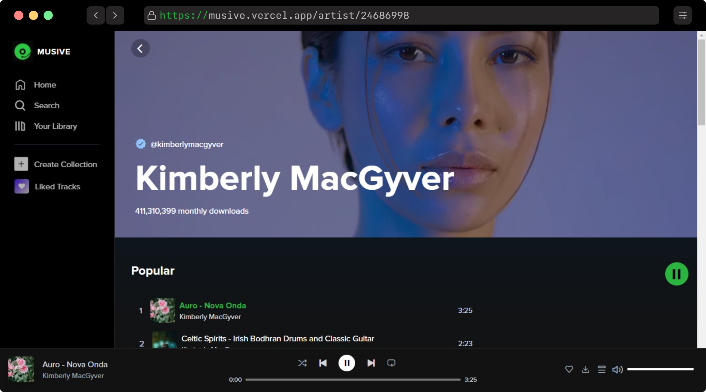
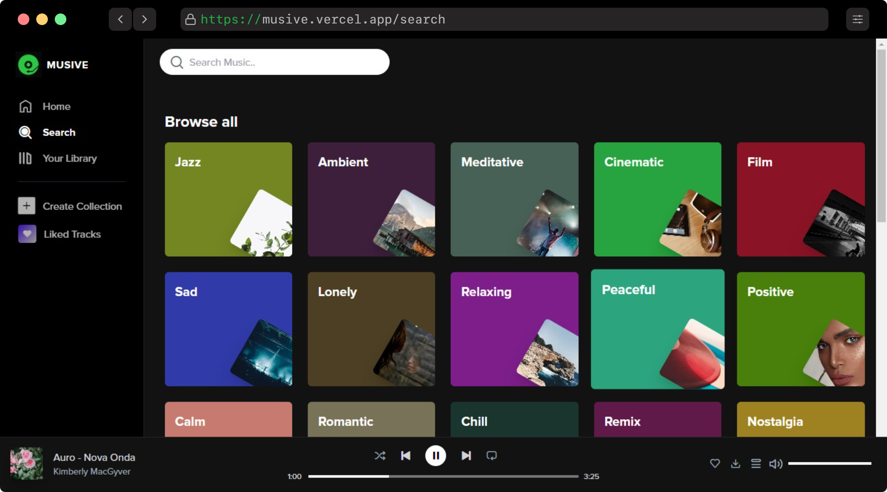
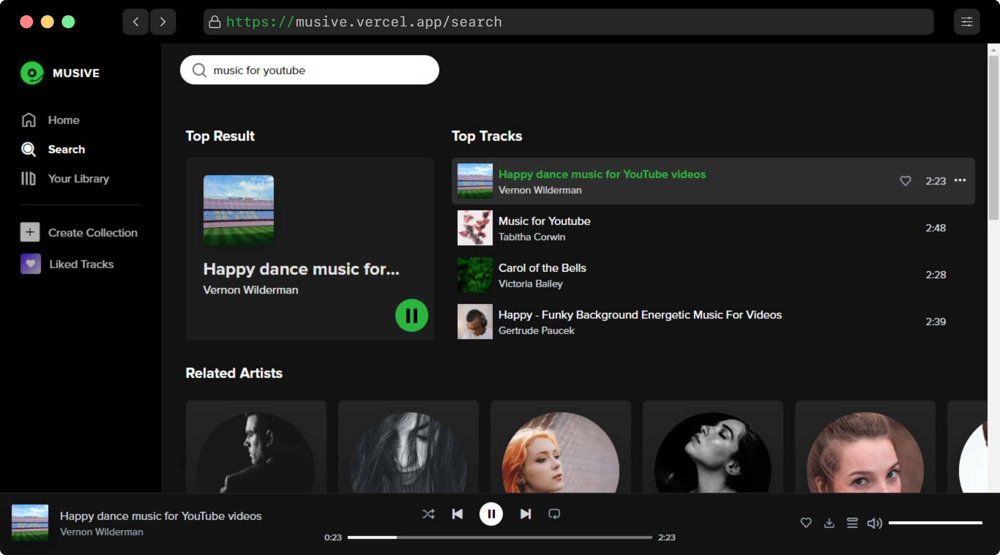
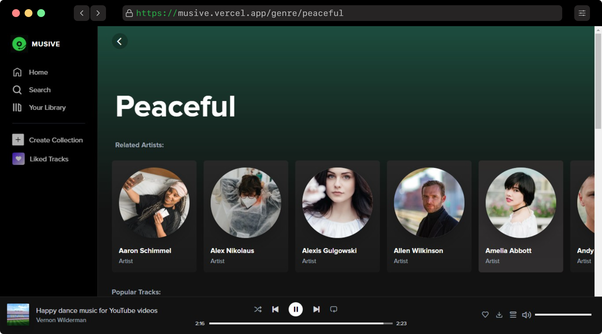
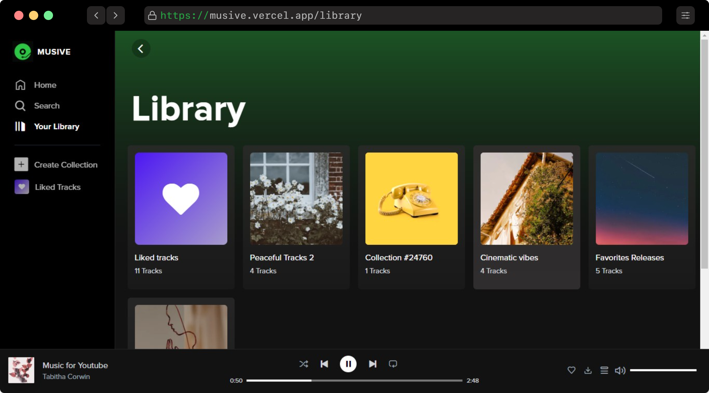
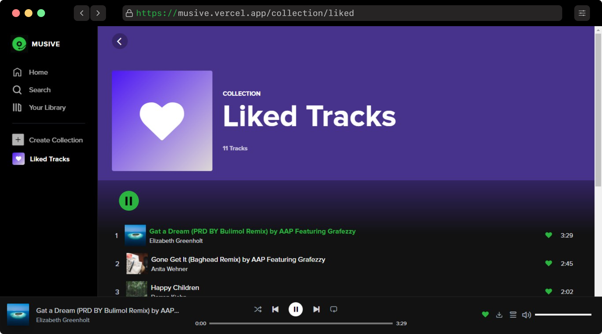
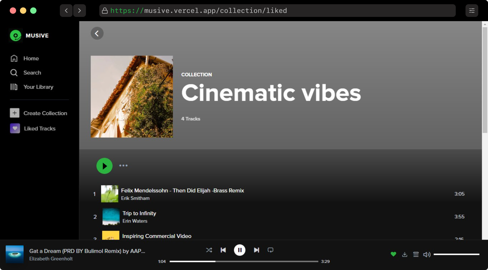

# musive-nextjs

# Musive Web App

Explore & download free stock music and use it anywhere you like with spotify web player experience.

Fully working Music player web app built in nextjs with typescript support and tailwindCSS. Used Algolia for fastest search response. [Backend](https://github.com/Ansh-Rathod/Musive-backend-2.0) is written in nodejs with PostgreSQL (more info vist backend repo).

<br/>

## Demo

[](https://musive.vercel.app)


## Features

- App includes all Working features that spotify client provides.
- Available for all screen Mobile, tablet, laptop and desktop.
- The app is made to give a user full experience of spotify client.
- It has almost same UI as Spotify for every page.
- 10,000+ stock music for added.
- Recordable list for queue management with react-beautiful-dnd.

# Image Gallery

### Authentication Page





### Home Page





### Artist Profile Page





### Search Page



 



### Genre Page





### Library Page





### Collections Page







## Getting Started

First, Deploy the backend server from instractions are in [backend repo](https://github.com/Ansh-Rathod/Musive-backend-2.0):

- Change the <code>url</code> variable in file <code>config/url.ts</code>
- Check out the Algolia integration section in [backend repo](https://github.com/Ansh-Rathod/Musive-backend-2.0) for search feature.

```bash
npm run dev
# or
yarn dev
```

Open [http://localhost:3000](http://localhost:3000) with your browser to see the result.

<br/>

# Contact me

for backend or any other configuration feel free to contact me.

[](anshrathod29@gmail.com)


[](https://twitter.com/anshrathodfr)


[](https://www.linkedin.com/in/ansh-rathod/)


  
